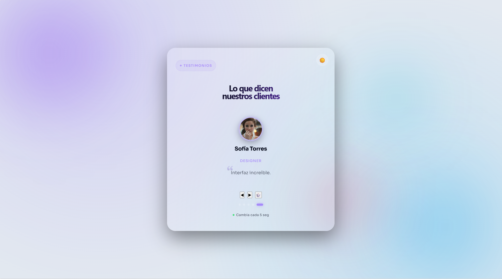

# TESTIMONIOS APP | REACT FRONTEND ARCHITECTURE
---

<p align="center">
  
</p>

<p align="center">
  <a href="https://app-testimonios-front-end.vercel.app/" target="_blank">
    
  </a>
  
  
</p>

## DESCRIPCIÓN GENERAL

Aplicación interactiva de testimonios desarrollada con React, diseñada bajo principios de experiencia de usuario moderna y estética glassmorphism. El sistema implementa navegación dinámica, persistencia de estado y un motor de reproducción automática.

---

## LIVE DEMO
Para visualizar la aplicación en un entorno de producción, acceda a través del siguiente enlace:

[](https://app-testimonios-front-end.vercel.app/)

---

## ESPECIFICACIONES TÉCNICAS

* **Slider Dinámico:** Sistema de navegación manual (previo, siguiente, aleatorio).
* **Autoplay Engine:** Ciclo de reproducción automática gestionado mediante hooks.
* **State Management:** Control centralizado de posición y estados de animación.
* **Persistence Layer:** Implementación de modo claro/oscuro persistente vía Web Storage API.
* **Layout:** Diseño responsivo basado en CSS Grid y Flexbox bajo enfoque Mobile-First.

---

## STACK TECNOLÓGICO

* **Core:** React.js (Hooks: useState, useEffect, useCallback).
* **Build Tool:** Vite.
* **Estilos:** CSS3 con variables dinámicas y animaciones de entrada/salida.
* **Lógica:** JavaScript ES6+.

---

## LÓGICA DE INGENIERÍA

* **Navegación Circular:** Implementación de lógica aritmética para prevenir desbordamientos de índice (index out of bounds), garantizando un ciclo infinito fluido en el arreglo de datos.
* **Optimización UX:** Integración de buffers de animación y control de estados de transición para asegurar cambios visuales suaves entre testimonios.
* **Desacoplamiento:** Arquitectura basada en la separación estricta entre la estructura de datos (`data.js`) y la lógica de renderizado, facilitando futuras integraciones con APIs externas.

---

## ARQUITECTURA DE ARCHIVOS

El proyecto se organiza en componentes modulares y reutilizables:

```text
src/
├── components/
│   ├── Testimonial.jsx   # Presentación de contenido
│   └── Controls.jsx      # Interfaz de navegación
├── data.js               # Fuente de datos local
├── App.jsx               # Orquestador lógico
└── App.css               # Definición de estilos globales
```

---

## INSTALACIÓN LOCAL

Para ejecutar el proyecto en un entorno local de desarrollo:

1. **Clonar repositorio:**
   ```bash
   git clone [https://github.com/JesusGG2109/App-Testimonios-FrontEnd-.git](https://github.com/JesusGG2109/App-Testimonios-FrontEnd-.git)

2. **Instalar dependencias:**

```bash
npm install
```

3. **Ejecutar servidor de desarrollo:**

```bash
npm run dev
```
---

## AUTORÍA Y REPOSITORIO

**JesusGG2109** - *Frontend Developer* [Repositorio Oficial del Proyecto](https://github.com/JesusGG2109/App-Testimonios-FrontEnd-)

---
> "The interface is the bridge between the data and the human experience."